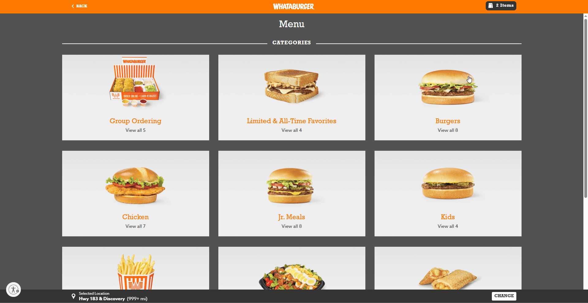

# Whataburger Redesign - Fullstack Clone (Unofficial)

## Overview
This is a fullstack web application simulating a fast food ordering system of Whataburger, rebuilt with modern technologies to enhance usability and maintainability.

Features include:
* User-friendly homepage
* Single Page Application (SPA)
* Role-based system (Admin, Employer, User, Guest) 
* Clear and readable order customization interface
* Cart management for both guests and logged-in users
* User authentication and session management
* Responsive design

**Note:** This is a self-initiated project created to explore real-world web application structure and is not affiliated with Whataburger.

## Motivation
The project was built for the following reasons:
* To practice fullstack development by tackling real-world application complexity
  
* To redesign and improve the Whataburger website's UI/UX out of personal passion as a former employee and longtime fan of the brand

### Original website

* The website lacks structural clarity and user-centered flow, which is critical for modern e-commerce platforms.

* The website lacks the modern UX patterns common in today's web applications.

## Current website

## Tech Stack
### Frontend
* React.js
* Tailwind CSS

### Backend
* Spring Boot
* Spring Security
* JPA (Hibernate)
* MySQL

### Others
* Redis (session/cart cache)
* Lucid Chart (diagrams)
* JUnit (testing)
* Rest API

## Features
* Customizable Order System
* Store System (Planned)
* Cart System
* Authentication System
* Admin System
* Payment System (Planned)
* Responsive Design (Ongoing)

## Plan
- [ ] Admin logic
- [ ] Store logic
- [x] User logic
- [x] Order logic
- [x] Cart logic
- [ ] Payment logic
- [ ] Order history
- [ ] Logging useful data
- [ ] Chatbot
- [ ] Deployment

**Note:** Checked features indicate features that already contain necessary functionalities.

## How to Run