# Whataburger Order System 🍔 - Fullstack Clone (Unofficial)

**Note:** This is a self-initiated project created to explore real-world web application structure and is not affiliated with Whataburger.

## Links
**Demo Video** 🎥: https://www.loom.com/share/13a3021b66954868aee45c00dcd2d08b

**Demo Web Page** 💻: https://whattheburger-frontend.vercel.app

**Backend Github** 🖥: https://github.com/wndyd0131/whattheburger_backend

## Screenshots
### User
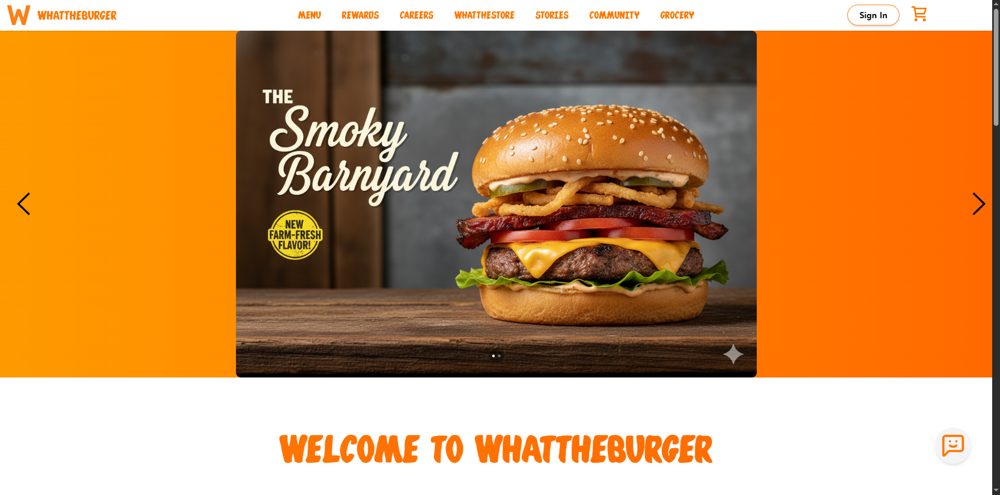
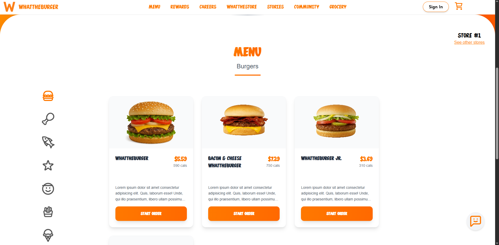
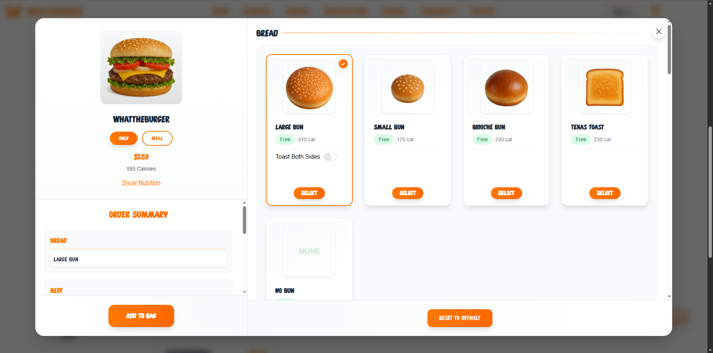
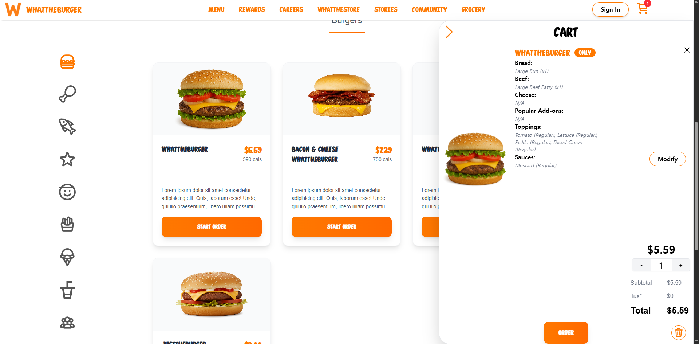
### Admin
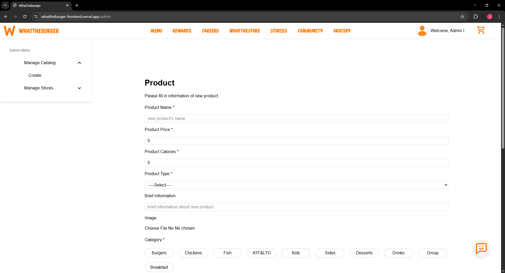
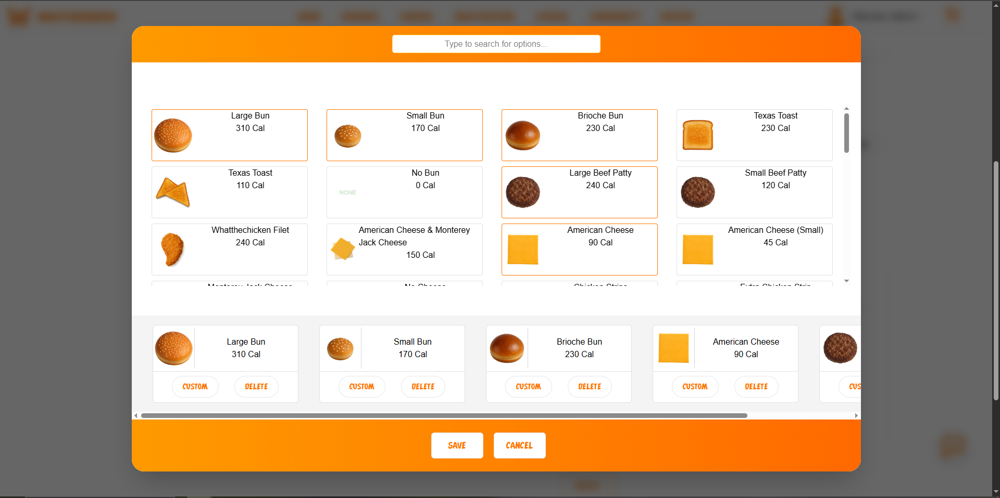

## Overview
This project focuses on building real fast-food restaurant ordering flows inspired by Whataburger, including customizable menu, cart/order sessions, store-specific pricing, and secure payment processing. The goal is to replicate production-oriented backend design considering maintainability and redesign with user-friendly UI.

## Key Features
* Menu System
  * Customizable menu selection
  * Store-specific availability, pricing, and rules (implementing)
* Store System
  * Store selection nearby typed location
* Cart System
  * Add to cart
  * Modify cart
  * Delete cart
* Role-based System
  * Admin
  * User
  * Guest
* Order System
  * Create order session
* Checkout System
  * Stripe card payment integration
* Admin System
  * Create catalog
  * Register products to stores
  * Modify store-specific products (implementing)
* Delivery Simulation
  * Real-time delivery status notification (implementing)

## System Highlights
- Designed **Server-side cart/order session** storage using Redis
- Implemented **Role-based access control** using Spring Security
- Implemented **Nearby stores rendering** using Mapbox and Mysql
- Implemented **Clean client logic** using reducer pattern 
- Integrated **Stripe Checkout with webhooks** for reliable order/payment confirmation
- Deployed full stack on **Vercel + AWS EC2 with Docker + NGINX + HTTPS**

<!-- ### 🧾 User Flow
1. User presses menu button
   1. If cookie exists, the user moves to menu page of an already selected store.
   2. If not, then the user goes to store selection page.
2. Store selection
   1. The user types in location address they are going to receive the product (somewhere in the U.S. where Whataburger stores are likely to exist).
   2. Press "See Menu" button
3. Authentication
   1. User can either create their own account for later point system or just skip it and continue as guest. -->

## Tech Stack
### Frontend
* React.js
* Tailwind CSS

### Backend
* Spring Boot
* Spring Security
* JPA (Hibernate)
* MySQL
* Redis (session/cart cache)

### Infrastructure & Deployment
* AWS EC2
* AWS S3
* NGINX (Reverse Proxy)
* Docker / Docker Compose
* Vercel
* Python (Script)

### Third-party
* Overpass + OSMPythonTools (Whataburger location data)
* Mapbox API (Store selection)
* Stripe API (Payment processing)

### Development & Documentation
* Lucid Chart (Diagrams)
* JUnit (Testing)
* Swagger (API Docs)

## System Design
### Entity Relationship Diagram
  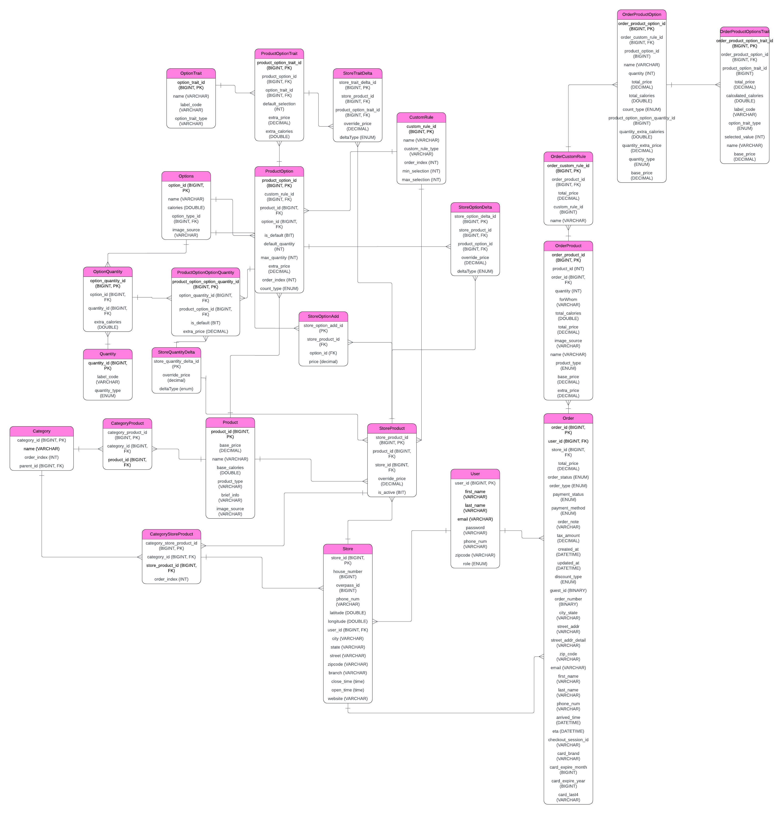

### C2 Diagram

### System Architecture
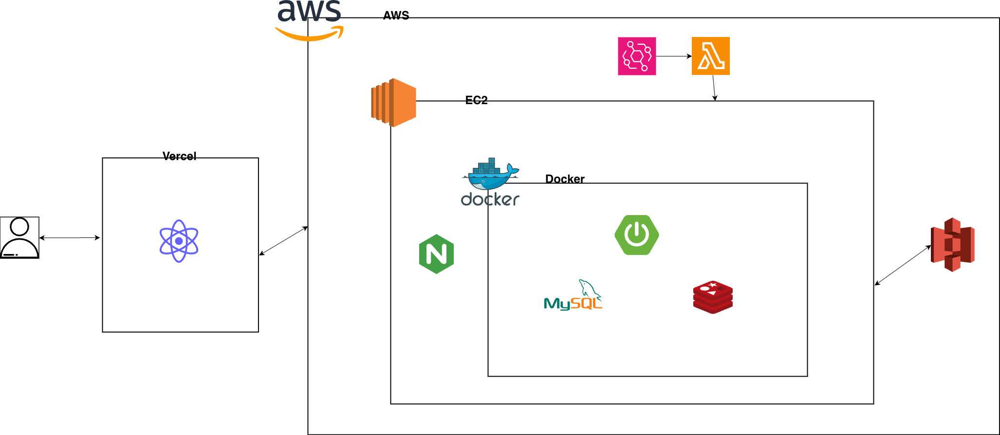
### Sequence Diagrams
#### Store Selection
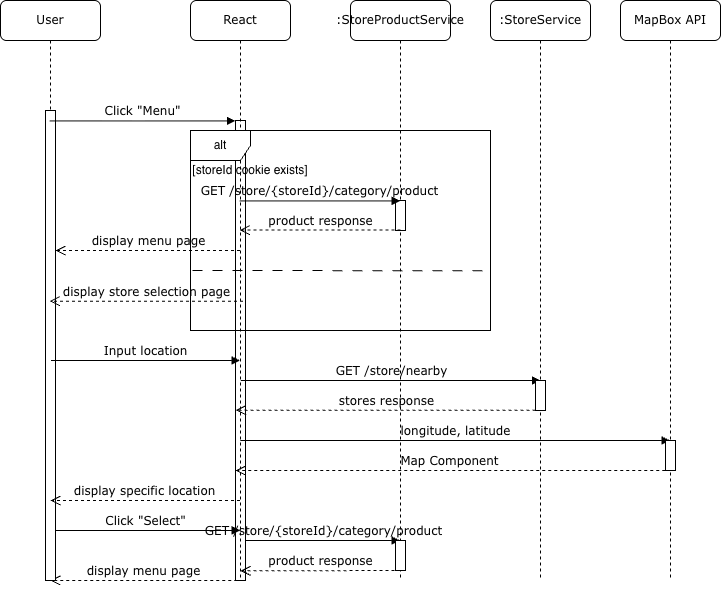
#### Add To Cart
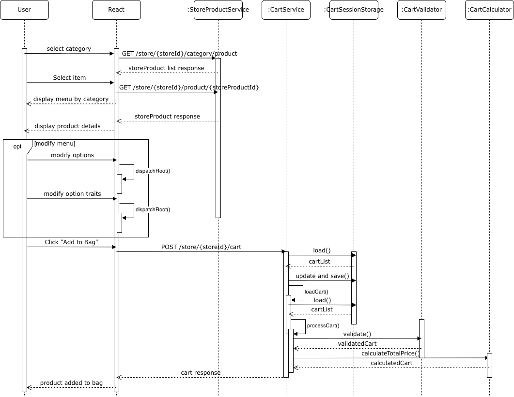
#### Checkout
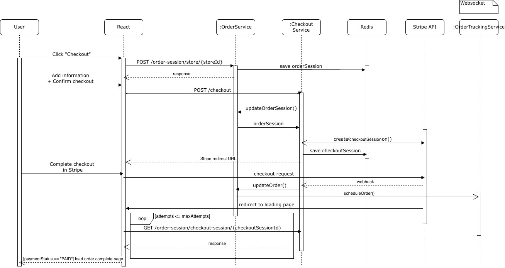
#### Order Tracking
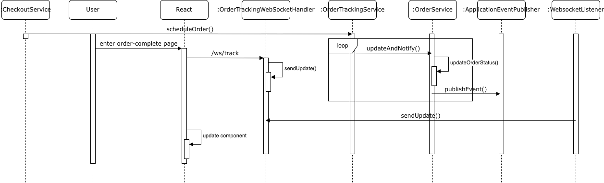

## Roadmap
- **Admin**
  - [x] Create Catalog Product
  - [x] Register Product to Stores
  - [ ] Update Product for each Store
- **Product**
  - [x] Single product
  - [ ] Meal product
- [x] **Store logic**
- [x] **User logic**
- **Order**
  - [x] Delivery Order
  - [ ] Pickup Order
- **Cart**
  - [x] Add to cart
  - [x] Modify cart
  - [x] Load cart
- **Payment**
  - [x] Stripe integration
  - [x] Order complete post-processing
  - [ ] Exception handling
- **Order Tracking**
  - [x] Order status random scheduling
  - [x] Order status real-time update
- **Order History**
  - [ ] Search
  - [ ] Filter
    - [ ] Date
    - [ ] Order Type
    - [ ] Order Status
    - [ ] Price
  - [x] Pagination
  - [x] Sorting
- [ ] **Recommendation System**
- [x] **Deployment**
